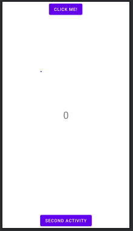

# ActivityLifecycle

The lifecycle is the set of states an activity can be in during its entire lifetime, from when it's created to when it's destroyed and the system reclaims its resources.
As a user navigates between activities in app, activities transition between different states in their lifecycles.

The application shows different activity life cycle as a log message during debug mode while changing activity and clicking to increase number.

